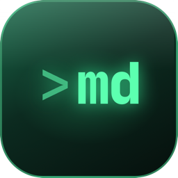

# mido



[](https://crates.io/crates/mido)
[](https://crates.io/crates/mido)
[](https://github.com/anistark/mido/actions/workflows/ci.yml)
[](https://crates.io/crates/mido)
[](https://anistark.github.io/mido)
[](./LICENSE)

_Markdown In, Document Out_

A terminal Markdown reader that renders documents the way a good reader app does: real heading hierarchy, a comfortable line measure, syntax-highlighted code, and tables that line up. Built in Rust on [ratatui](https://ratatui.rs).

## Install

```sh
cargo install mido
```

That needs a Rust toolchain of 1.93 or newer. For the latest commit instead of the latest release:

```sh
cargo install --git https://github.com/anistark/mido
```

## Use

```sh
mido README.md          # open one file
mido docs/              # browse a folder: files on the left, outline on the right
mido                    # the current folder
mido -                  # read Markdown from stdin
mido -p README.md       # print styled text to stdout, pipe it to less -R
mido -w 80 notes.md     # cap the width (default: full terminal width)
mido docs               # read the bundled documentation offline
```

The full documentation is at [anistark.github.io/mido](https://anistark.github.io/mido).

Piping without `-p` prints plain text, so `mido file.md > out.txt` never leaks escape codes.

## Keys

| Key | Action |
| --- | --- |
| `j` / `k`, arrows, wheel | Scroll one line |
| `Ctrl-d` / `Ctrl-u` | Half page |
| `Ctrl-f` / `Ctrl-b`, `Space` | Full page |
| `g` / `G` | Top / bottom |
| `b` / `o` | Toggle the files / outline panel |
| `f` | Focus mode: hide the panels, full width |
| `Tab` / `Shift-Tab` | Cycle focus between the panes |
| `Tab` then `←` / `→` | Move focus in that direction |
| `l` | Focus the pane to the right |
| `j` / `k` in a panel | Move, `Enter` opens or returns |
| `Space`, `←` / `→` in a panel | Fold, collapse / expand a folder or section |
| `-` / `=` in a panel | Fold all / unfold all |
| `T` in the files panel | Show titles instead of file names |
| `]` / `[`, `Enter`, click | Select the next / previous link, follow it |
| `H` / `L` | Back / forward through visited pages |
| `Ctrl-p` | Find a file in the folder |
| `E` | Edit the file in `$EDITOR`, reload on return |
| `/` then `n` / `N` | Search, next, previous |
| `t` | Table of contents |
| `i` | Show or hide images |
| `m` | Expand or collapse the front matter |
| `r` | Reload |
| `h`, `?` | Help |
| `q` | Quit |

The file is watched, so edits in another window show up as you save. In a folder the whole tree is watched, and new or removed files appear in the files panel.

Open a folder and mido lists its Markdown files in a sidebar on the left headed by the folder's name, the tree hanging from it with folders first, honouring `.gitignore` and skipping hidden files. It starts on README.md, then index.md, then the first file. Relative links open in place, `#anchors` jump to their heading, and web links open in your browser. `H` and `L` walk back and forward through what you have visited.

On terminals wide enough an outline of the headings sits in a tinted card at the top right, and the text wraps before it. It follows your reading position. Press `Tab` or `l` to move into it, `j` / `k` to jump between sections, `Space` to fold a section, and `Tab` or `Enter` to come back. `Shift-Tab` moves the other way, into the files sidebar.

## What renders

- Headings, paragraphs, *emphasis*, **strong**, ~~strikethrough~~ and `inline code`
- Links with their URL, wikilinks, footnotes[^1] with a popup for the note
- Images drawn in Kitty, iTerm2 and Sixel terminals, half-blocks elsewhere
- GitHub alerts, front matter as a collapsible card, definition lists, emoji shortcodes, math as styled source
- Nested lists, ordered lists, task lists
  - [x] like this one
  - [ ] and this one
- Blockquotes, nested as deep as you like
- Fenced code with syntax highlighting for the languages bat ships
- GFM tables with alignment and wrapped cells
- Mermaid diagrams drawn with box characters: flowcharts, sequence, class and state diagrams, plus pie, gantt, mindmap, timeline, git graphs and more

> Anything mido cannot render, such as raw HTML, is shown as source rather than dropped.

Checkout [Changelog](./CHANGELOG.md) for all updates. Contributions are welcome, see [CONTRIBUTING.md](./CONTRIBUTING.md).

## License

[MIT](./LICENSE)

[^1]: Footnotes collect at the end of the document.
