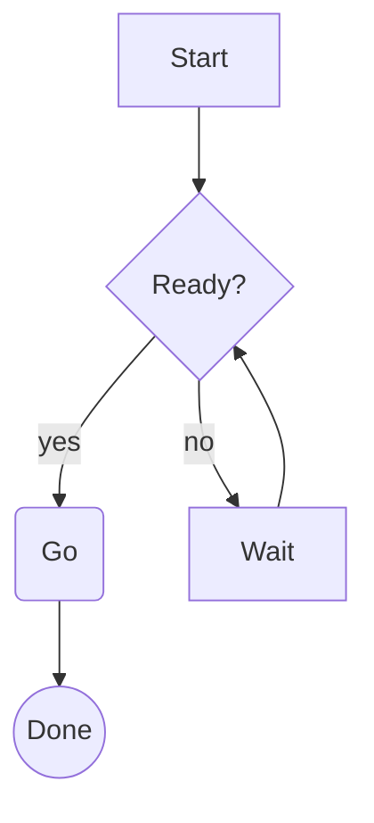

# What renders

mido parses CommonMark plus the GitHub extensions and draws every element with its own treatment. Anything it cannot render is shown as source rather than dropped.

## Headings

| Level | Treatment |
| --- | --- |
| H1 | A title chip: bold dark text on the accent color |
| H2 | Bold in the second accent, underlined by a rule exactly as wide as the text |
| H3 | Bold in the third accent, with a faint `###` marker and a hanging indent |
| H4 to H6 | Faint `#` markers. H6 is italic |

## Text

- Paragraphs wrap at the measure, with one blank line between blocks.
- *Emphasis*, **strong** and ~~strikethrough~~ use the terminal's italic, bold and crossed-out attributes, and fall back to color where an attribute is missing.
- `Inline code` sits on a tinted background with a space of padding each side.
- Links are underlined, with the URL shown dim after the text. Wikilinks like `[[Page]]` are underlined without a URL.
- Emoji shortcodes such as `:tada:` become the emoji, using GitHub's shortcode table.
- Math in `$..$` is shown as styled source, delimiters included, so nothing is guessed.
- Footnote markers are superscript digits, and the definitions collect after a rule at the end of the document. Select a marker with `]` and press `Enter` to read the note in a popup.
- Smart punctuation turns straight quotes and dashes into their typographic forms.

## Lists

Nested lists use `•`, `◦` and `▪` by depth, with the markers colored by depth. Ordered lists keep the numbers from the source. Task lists draw `☐` and `☑`, with done items muted.

## Blockquotes and alerts

A bar in the quote color runs down the left with the text in italic. Nested quotes add a bar per level.

GitHub alerts are blockquotes that start with `[!NOTE]`, `[!TIP]`, `[!IMPORTANT]`, `[!WARNING]` or `[!CAUTION]`. Each kind gets its own color for the bar, an icon and a label on the first line, and the body stays upright:

```markdown
> [!WARNING]
> Ctrl-c leaves the viewer without asking.
```

## Definition lists

A term on its own line followed by lines starting with `: ` renders the term in bold and each definition indented beneath it.

## Images

An image on its own line is drawn in the terminal. mido queries the terminal for a graphics protocol at startup and uses Kitty, iTerm2 or Sixel when one answers, falling back to half-block characters everywhere else, including over SSH and inside tmux. The picture is scaled to the measure, at most 40 rows tall, and the alt text becomes a caption under it. `i` hides and shows images, and the notice names the protocol in use.

Local files resolve relative to the document. Remote images are off by default. Start mido with `--remote-images` to fetch them, capped at 10 MB each and cached in the user cache directory.

Images inside a sentence, images that fail to load and every image in print mode show as a placeholder with the alt text and path.

## Badges

Badge images, the shields.io row that READMEs open with, are drawn as labels instead of image placeholders: a two-tone chip with the badge name on the left and its value on the right, linked wherever the badge links, so `]` and `Enter` follow it. mido recognises the shields.io, badgen, badge.fury.io, forthebadge and deps.rs hosts, plus any URL with a `badge` segment such as GitHub's `badge.svg`. A static shields badge carries its text in the URL, so it shows in full offline. A live badge such as a crate version only knows its name until mido fetches it: start with `--remote-images` and the value is read from the badge's SVG title, so `crates.io` becomes `crates.io v0.4.0`. Nothing is downloaded without that flag.

## Display math

A `$$` block on its own renders as a fenced block of styled source:

```markdown
$$
\int_0^1 x^2 \, dx = \frac{1}{3}
$$
```

## Code

Fenced and indented code blocks sit on a tinted background behind a left bar, with the language label in the top right corner. Syntax highlighting covers the languages bat ships, through syntect and two-face, and loads lazily so opening a file stays instant. Code is never wrapped: a line wider than the screen is clipped with a faint `…` at the edge.

## Tables

GFM tables are drawn with light box characters, a bold header row on a surface band and a heavy line under it. Column alignment from the source is honoured, and long cells wrap inside their column instead of pushing the table wider than the screen.

## Rules and raw HTML

A thematic break is a `─` rule across the measure. Raw HTML is shown as-is, faint, wrapped like text.

## Mermaid diagrams

A fenced block with the `mermaid` language is drawn as a text diagram in the code style, with a `mermaid` label. This source:

````markdown

````

becomes this in the terminal:

```
       ┌───────┐
       │ Start │
       └───────┘
           │
           ▼
      ┌────────┐
      < Ready? >◄───────┐
      └────────┘        │
    ┌──┘  └─────┐       │
   yes         no       │
    ▼           ▼       │
 ╭────╮        ┌──────┐ │
 │ Go │        │ Wait │─┘
 ╰────╯        └──────┘
    │
    ▼
╭──────╮
│ Done │
╰──────╯
```

Flowcharts, sequence, class and state diagrams go through mmdflux. Pie, gantt, mindmap, timeline, git graphs and a dozen other types go through mermaid-text. A diagram of a type neither crate handles, or one too wide for the measure, keeps its labelled source instead.

## Front matter

A YAML (`---`) or TOML (`+++`) block at the top of a file is kept out of the text and shown as a row of labels, one two-tone chip per field with the key on the left and the value on the right. Lists read as comma-separated values, nested tables become dotted keys such as `author.name`, and long values are clipped at 40 columns. `m` swaps the row for a highlighted card with the source and back again. The pages of this documentation carry front matter for the site generator, so they are an example.

## What GitHub renders, and what mido does

| Element | mido |
| --- | --- |
| Headings, paragraphs, emphasis, strong, strikethrough | Rendered |
| Inline code, fenced and indented code, syntax highlighting | Rendered |
| Links, autolinks, reference links | Rendered, URL shown dim |
| Wikilinks | Rendered, resolved in the folder |
| Images | Rendered in Kitty, iTerm2, Sixel and half-block terminals, placeholder in print mode |
| Badges | Rendered as labels, live values with `--remote-images` |
| Lists, ordered lists, task lists | Rendered |
| Definition lists | Rendered |
| Blockquotes | Rendered |
| Alerts | Rendered with bar, icon and label |
| Tables with alignment | Rendered |
| Footnotes | Rendered, with a popup for the note |
| Emoji shortcodes | Rendered |
| Mermaid diagrams | Rendered as text for the supported types, source with a label otherwise |
| Math | Fallback, shown as styled source |
| Front matter | Rendered as labels, `m` opens the card |
| Raw HTML | Fallback, shown as faint source |
| Thematic breaks | Rendered |
