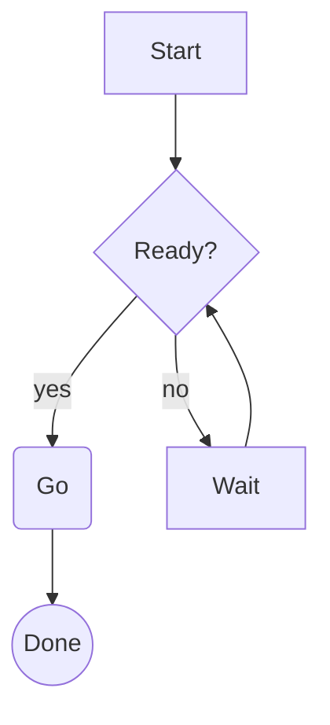

# What renders

mido parses CommonMark plus the GitHub extensions and draws every element with its own treatment. Anything it cannot render is shown as source rather than dropped.

## Headings

| Level | Treatment |
| --- | --- |
| H1 | A title chip: bold dark text on the accent color |
| H2 | Bold in the second accent, underlined by a rule exactly as wide as the text |
| H3 | Bold in the third accent, with a faint `###` marker and a hanging indent |
| H4 to H6 | Faint `#` markers. H6 is italic |

## Text

- Paragraphs wrap at the measure, with one blank line between blocks.
- *Emphasis*, **strong** and ~~strikethrough~~ use the terminal's italic, bold and crossed-out attributes, and fall back to color where an attribute is missing.
- `Inline code` sits on a tinted background with a space of padding each side.
- Links are underlined, with the URL shown dim after the text.
- Images show as a placeholder with their alt text and path.
- Footnote markers are superscript digits, and the definitions collect after a rule at the end of the document.
- Smart punctuation turns straight quotes and dashes into their typographic forms.

## Lists

Nested lists use `•`, `◦` and `▪` by depth, with the markers colored by depth. Ordered lists keep the numbers from the source. Task lists draw `☐` and `☑`, with done items muted.

## Blockquotes

A bar in the quote color runs down the left with the text in italic. Nested quotes add a bar per level.

## Code

Fenced and indented code blocks sit on a tinted background behind a left bar, with the language label in the top right corner. Syntax highlighting covers the languages bat ships, through syntect and two-face, and loads lazily so opening a file stays instant. Code is never wrapped: a line wider than the screen is clipped with a faint `…` at the edge.

## Tables

GFM tables are drawn with light box characters, a bold header row on a surface band and a heavy line under it. Column alignment from the source is honoured, and long cells wrap inside their column instead of pushing the table wider than the screen.

## Rules and raw HTML

A thematic break is a `─` rule across the measure. Raw HTML is shown as-is, faint, wrapped like text.

## Mermaid diagrams

A fenced block with the `mermaid` language is drawn as a text diagram in the code style, with a `mermaid` label. This source:

````markdown

````

becomes this in the terminal:

```
       ┌───────┐
       │ Start │
       └───────┘
           │
           ▼
      ┌────────┐
      < Ready? >◄───────┐
      └────────┘        │
    ┌──┘  └─────┐       │
   yes         no       │
    ▼           ▼       │
 ╭────╮        ┌──────┐ │
 │ Go │        │ Wait │─┘
 ╰────╯        └──────┘
    │
    ▼
╭──────╮
│ Done │
╰──────╯
```

Flowcharts, sequence, class and state diagrams go through mmdflux. Pie, gantt, mindmap, timeline, git graphs and a dozen other types go through mermaid-text. A diagram of a type neither crate handles, or one too wide for the measure, keeps its labelled source instead.

## Front matter

A YAML front matter block at the top of a file is skipped, so files written for a static site generator read cleanly. The pages of this documentation are an example.
